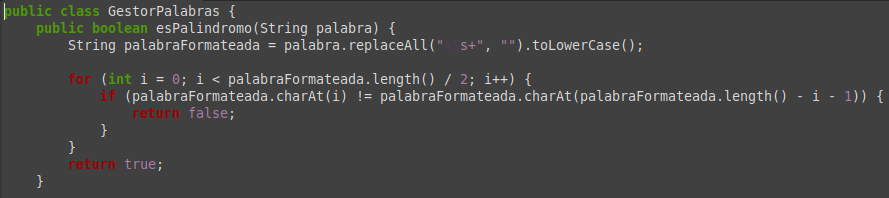
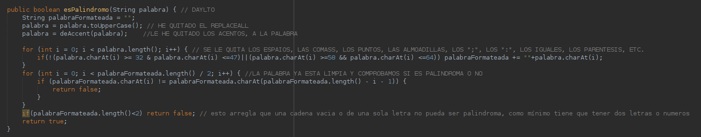
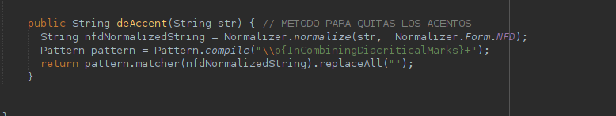
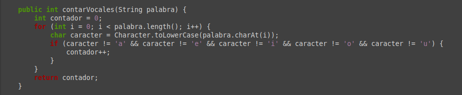
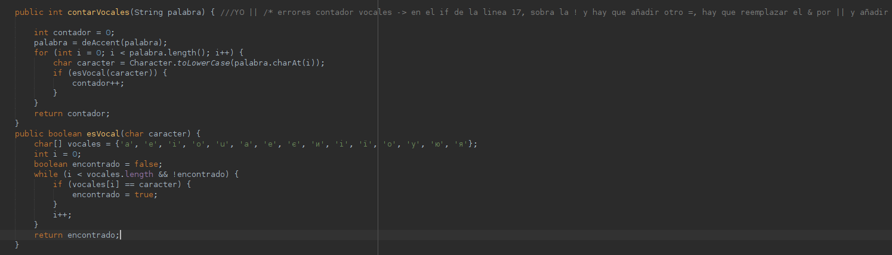
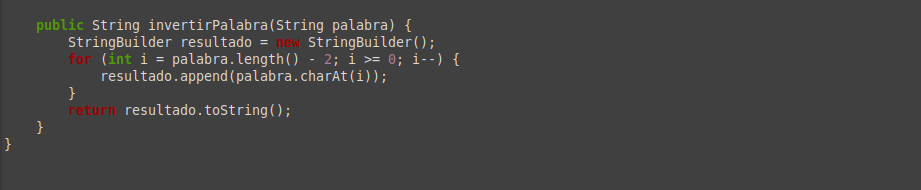
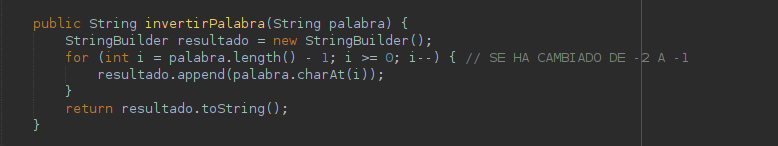

# TRABAJO-ENTORNOS-JAVA

* Nicola Bodnar Yuzyfishyn 
* Daylto Bravo Tinte

## PALINDROMOS

Lo que se ha modificado del código han sido bastantes cosas:

1. Quitamos el REPLACEALL que tenemos para los espacios, dado que tenemos también que quitar varias cosas. 

2. Tenemos que limpiar la String de acentos, dieresis, etc. para eso le pasamos un metodo llamado deAccent que podemos encontrar al final del archivo GestorPalabras.java
3. Cuando ya tenemos una parte de la String limpia tenemos que quitar los signos de puntuacion, para hacerlo hemos hecho un bucle que almacena la String limpia en otra String.
4. También se a puesto otra condición de que si la String cuando este completamente limpia si su longitud es menor a 2 retorne falso.

Aqui podriamos quitar los números si no los queremos como palindromos, nosotros lo hemos dejado dado en cuenta que un número puede ser palindromo o capicúa.

* **ANTES:**

* **AHORA:**

## CONTAR VOCALES

Cosas que he modificado en el método de contar las vocales:
1. en el "if" del método, tenia que quitar el signo '!' y sustituirlo por otro '='.
2. dentro del "if" reemplazar el '&' por '||'.
3. he metido un método llamado 'deAccent'que su finalidad es contar las vocales aun que tengan tilde o dieresis.
4. También he sustituido lo que habia en el "if" por un método que se llama "esVocal" para que me cuente también vocales en ucraniano.

* **ANTES:**

* **AHORA:**

## INVERTIR LA STRING

Lo unico modificado y el unico fallo encontrado es que no pillaba el último caracter de la String dado que pone un .length -2 en vez un .length -1.

* **ANTES:**

* **AHORA:**

	
